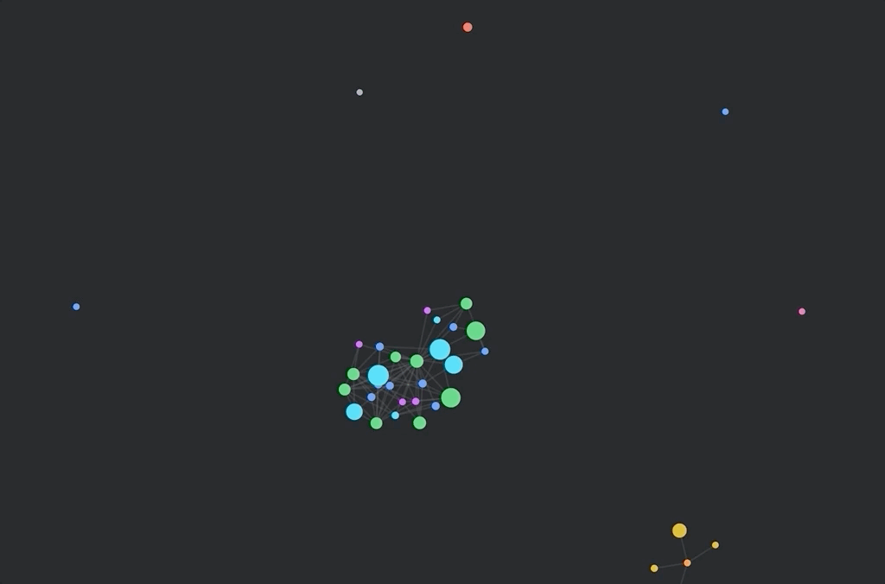

<div align="center">
  
  <h1>Graph View Plugin</h1>
  <p>A tool for Sanity Studio to graph your content and see changes in real-time.</p>
  <p></p>
</div>

Wonder how a visualization of your dataset will look? How many authors do you have? How many items have they worked on? And are currently working on! Edits and changes are shown in real-time!

**Explore your data with this plugin, seek out strange corners and data types, boldly go where you could not before!**

## Installation and use

**Important!** Due to an [outstanding issue with Three.js](https://github.com/sanity-io/sanity-plugin-graph-view/issues/4), you currently **have to use Yarn to install packages** and add this to your project's `package.json`:

```json
  "resolutions": {
    "**/three": "0.119.1"
  }
```

```sh
# In your Sanity Studio repository:
sanity install graph-view

# Start the Studio
sanity start
```

## Configuration

Edit `./config/graph-view.json`:

```json
{
  "query": "*[_type in ['a', 'b']]"
}
```

For references to turn into graph edges, the entire document must be fetched, but you can also selectively filter what references will be included. For example:

```json
{
  "query": "*[_type in ['a', 'b']]{ 'refs': [author, publisher] }"
}
```

By default, the plugin uses `doc.title || doc.name || doc._id` as the node label.

If you want to use another property, compute a `title` property in your query, e.g.:

```json
{
  "query": "*[_type in ['a', 'b']] { ..., \"title\": select(_type == 'a' => 'Title A', _type == 'b' => 'Title B') }"
}
```

## Contributing

If you want to take part in developing this plugin, then look for planned features in the [list of issues](https://github.com/sanity-io/sanity-plugin-graph-view/issues) and reach out to us in the [Sanity Community](https://slack.sanity.io/).

```sh
git clone git@github.com:sanity-io/sanity-plugin-graph-view.git
cd sanity-plugin-graph-view
yarn
yarn link

# In a development Studio directory:
yarn link sanity-plugin-graph-view

# Lint your code before committing
yarn lint
```

## Get help in the Sanity Community

[](https://slack.sanity.io/)

Join [Sanity’s developer community](https://slack.sanity.io) or ping us [on twitter](https://twitter.com/sanity_io).

## License

MIT © [Sanity.io](https://www.sanity.io/)
